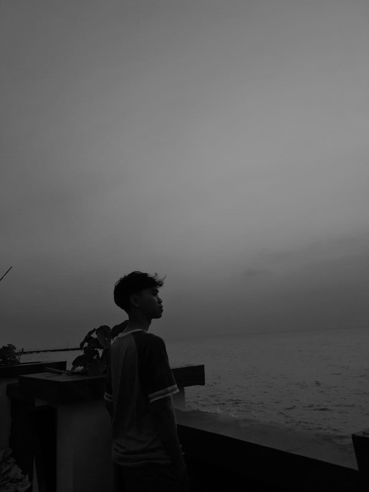
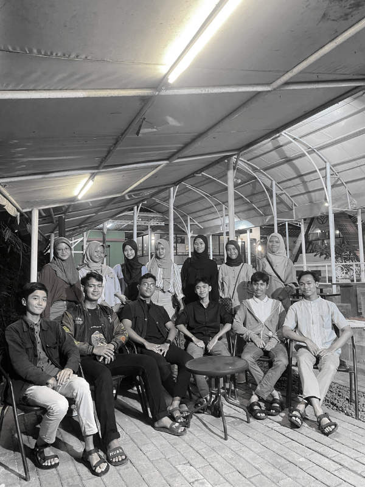
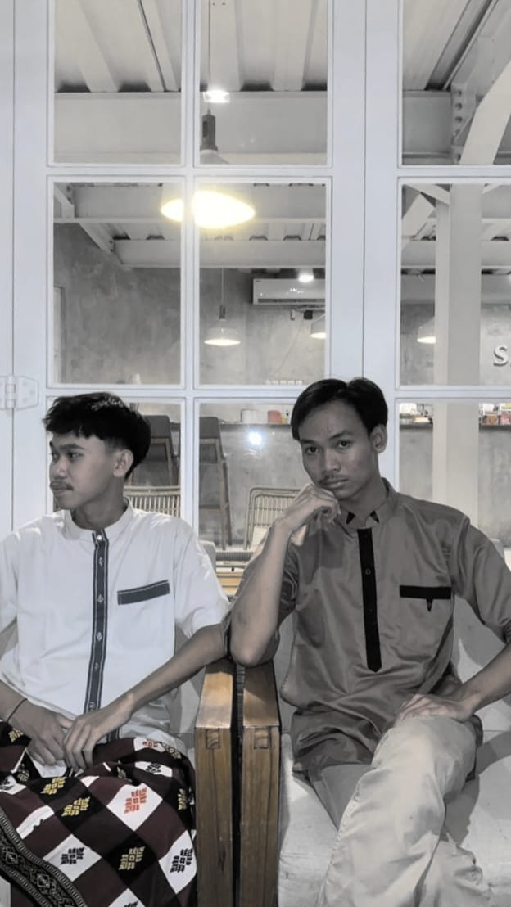
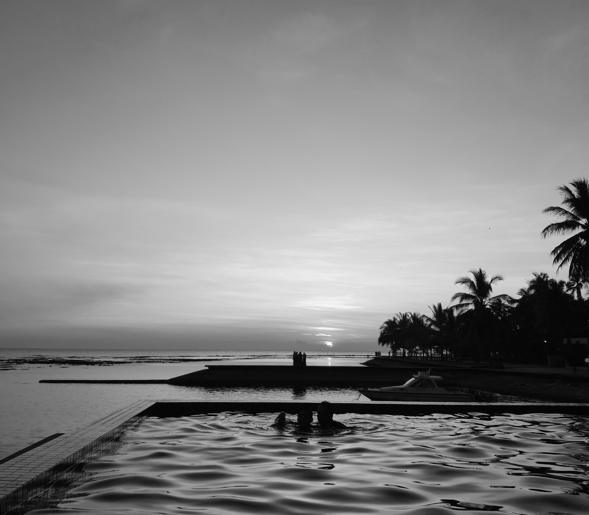
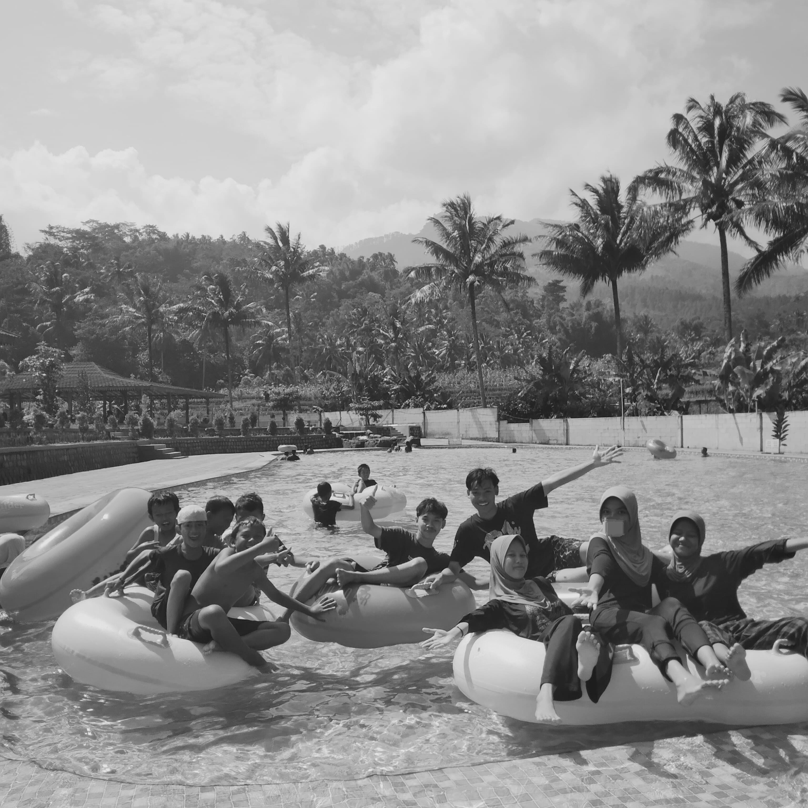
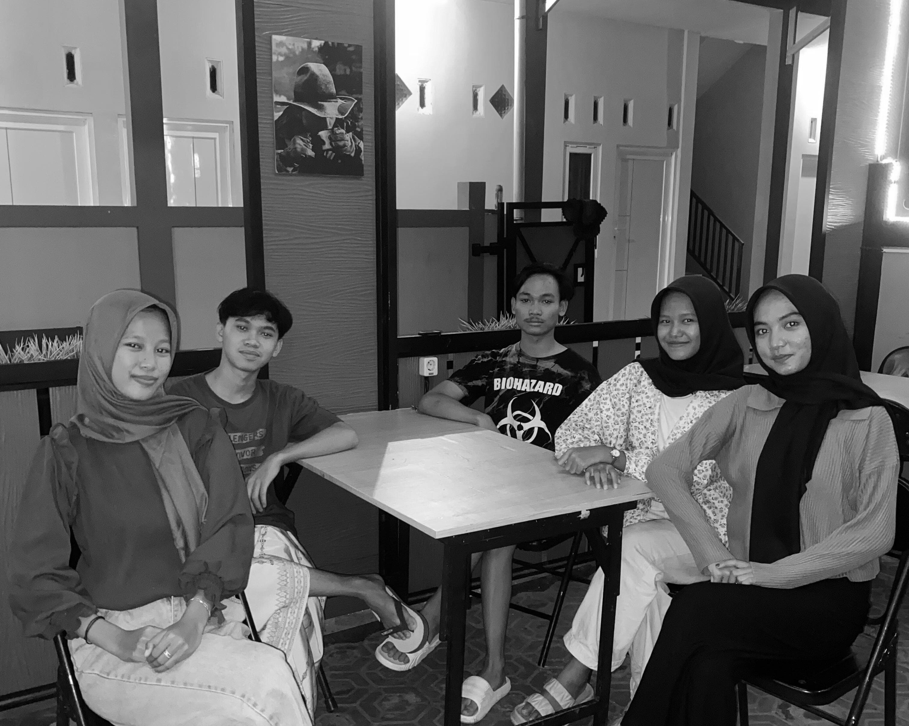
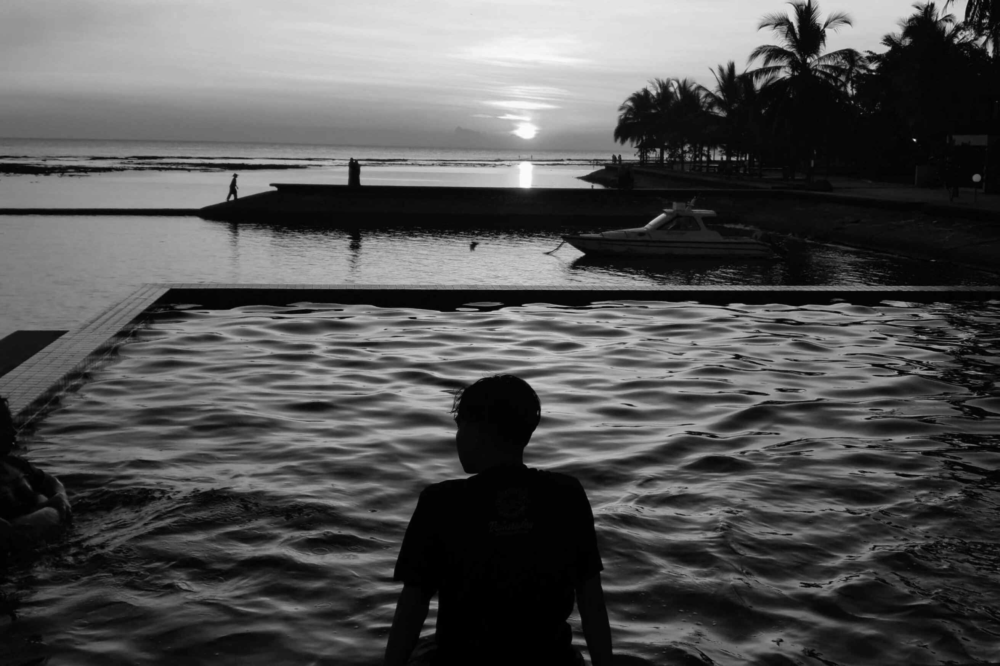

<!DOCTYPE html>

<html>

  <head>

    <title>PSP Projects</title>

    <meta charset="UTF-8">

    <meta name="viewport" content="width=device-width, initial-scale=1">

    <link rel="stylesheet" href="https://www.w3schools.com/w3css/4/w3.css">

    <link rel="stylesheet" href="https://fonts.googleapis.com/css?family=Montserrat">

    <link rel="stylesheet" href="https://cdnjs.cloudflare.com/ajax/libs/font-awesome/4.7.0/css/font-awesome.min.css">

    

  </head>

<body class="w3-black">

  

<!-- Icon Bar (Sidebar - hidden on small screens) -->

<nav class="w3-sidebar w3-bar-block w3-small w3-hide-small w3-center">

  <!-- Avatar image in top left corner -->

  

  <a href="#" class="w3-bar-item w3-button w3-padding-large w3-black">

    <i class="fa fa-home w3-xxlarge"></i>

    
HOME

  </a>

  <a href="#about" class="w3-bar-item w3-button w3-padding-large w3-hover-black">

    <i class="fa fa-user w3-xxlarge"></i>

    
ABOUT

  </a>

  <a href="#photos" class="w3-bar-item w3-button w3-padding-large w3-hover-black">

    <i class="fa fa-eye w3-xxlarge"></i>

    
PHOTOS

  </a>

  <a href="#contact" class="w3-bar-item w3-button w3-padding-large w3-hover-black">

    <i class="fa fa-envelope w3-xxlarge"></i>

    
CONTACT

  </a>

</nav>

  

<!-- Navbar on small screens (Hidden on medium and large screens) -->

  

    <a href="#" class="w3-bar-item w3-button" style="width:25% !important">HOME</a>

    <a href="#about" class="w3-bar-item w3-button" style="width:25% !important">ABOUT</a>

    <a href="#photos" class="w3-bar-item w3-button" style="width:25% !important">PHOTOS</a>

    <a href="#contact" class="w3-bar-item w3-button" style="width:25% !important">CONTACT</a>

  

  

<!-- Page Content -->

  <!-- Header/Home -->

  <header class="w3-container w3-padding-32 w3-center w3-black" id="home">

    <h1 class="w3-jumbo">I'm Pancar Wahyu.</h1>

    
Students of Informatics Study Programme, Faculty of Engineering.

    

  </header>

  

  <!-- About Section -->

  

    <h2 class="w3-text-light-grey">My Name</h2>

    

    
Pancar Wahyu Setiabi, a young man born in Brebes on 22 December 2005, is the second of three children. Since childhood, I have been educated in Islamic institutions.

  

        Pancar's educational journey began at the Muslimat Kindergarten for one year. After that, he continued his education at the Islamic School for six years. Then, I went to junior high school at the Nurusshibyan Foundation for three years.

        After that, he studied at Madrasah Aliyah Negeri 2 for the last three years. Apart from studying, I also enjoy some of his hobbies, namely drinking coffee and playing PlayStation games, especially football sports games.

        Despite being young, I have undergone quite a long educational journey within Islamic schools. The experience and knowledge that I have gained during my education will certainly be a valuable provision for me in navigating life in the future..

    

    <h3 class="w3-padding-16 w3-text-light-grey">My Hobbies</h3>

    

    
Editing Photo and Video

    

        

    

    
Playing Playstation

    

        

    

    
Swimming

    

        

    
 

    

        

            101+ 

            Partners

        

        

        5+ 

        Match Lose

    

    

        95+ 

        Match Win

    

    

        100+ 

        Match

    

<h3 class="w3-padding-16 w3-text-light-grey">My Education</h3>

    

      

        <ul class="w3-ul w3-white w3-center w3-opacity w3-hover-opacity-off">

          <li class="w3-dark-grey w3-xlarge w3-padding-32">Education Level</li>

          <li class="w3-padding-32">Muslimat Kindergarten</li>

          <li class="w3-padding-32">Ma'ahidil Mubarok Islamic School</li>

          <li class="w3-padding-32">Nurusshibyan Junior High School</li>

          <li class="w3-padding-32">Islamic Senior High School 2 Brebes</li>

          </li>

          <li class="w3-light-grey w3-padding-32">

            <button class="w3-button w3-white w3-padding-large w3-hover-black">Sign Up</button>

          </li>

        </ul>

      

  

      

        <ul class="w3-ul w3-white w3-center w3-opacity w3-hover-opacity-off">

          <li class="w3-dark-grey w3-xlarge w3-padding-32">Education Place</li>

          <li class="w3-padding-16">Karangnagka, Winduaji, Kec. Paguyangan, Kabupaten Brebes, Jawa Tengah 52276</li>

          <li class="w3-padding-24">Jl, Waduk Penjalin, Keseran, Winduaji, Kec. Paguyangan, Kabupaten Brebes, Jawa Tengah 52276</li>

          <li class="w3-padding-24">Jl. Kaligua No.6, Penisihan, Taraban, Kec. Paguyangan, Kabupaten Brebes, Jawa Tengah 52276</li>

          <li class="w3-padding-24">Jl. Jenderal Sudirman, Laren, Kec. Bumiayu, Kabupaten Brebes, Jawa Tengah 52273</li>

          </li>

          <li class="w3-light-grey w3-padding-24">

            <button class="w3-button w3-white w3-padding-large w3-hover-black">Sign Up</button>

          </li>

        </ul>

      

    <!-- End Grid/Pricing tables -->

    

  <!-- Portfolio Section -->

  

    <h2 class="w3-text-light-grey">My Photos</h2>

    

  

    <!-- Grid for photos -->

    

      

        

        

        

      

  

      

        

        

        

        

      

    <!-- End photo grid -->

    

  <!-- End Portfolio Section -->

  

  

  <!-- Contact Section -->

  

    <h2 class="w3-text-light-grey">Contact Me</h2>

    

  

    

      
<i class="fa fa-map-marker fa-fw w3-text-white w3-xxlarge w3-margin-right"></i> Dusun 1, Blater, Kalimanah, Purbalingga Regency, Central Java 53371 

      
<i class="fa fa-phone fa-fw w3-text-white w3-xxlarge w3-margin-right"></i> Phone: +62 8570-5055-28

      
<i class="fa fa-envelope fa-fw w3-text-white w3-xxlarge w3-margin-right"> </i> Email: pancarwahyu687@gmail.com

    
 

  <i class="fa fa-facebook-official w3-hover-opacity"></i>

  <i class="fa fa-instagram w3-hover-opacity"></i>

  <i class="fa fa-twitter w3-hover-opacity"></i>

  <i class="fa fa-youtube w3-hover-opacity"></i>

  <i class="fa fa-linkedin w3-hover-opacity"></i>

 
This website was made PancarWahyu Space. Make your own free website today!

  

</footer>

  

<!-- END PAGE CONTENT -->

  

</body>

</html>